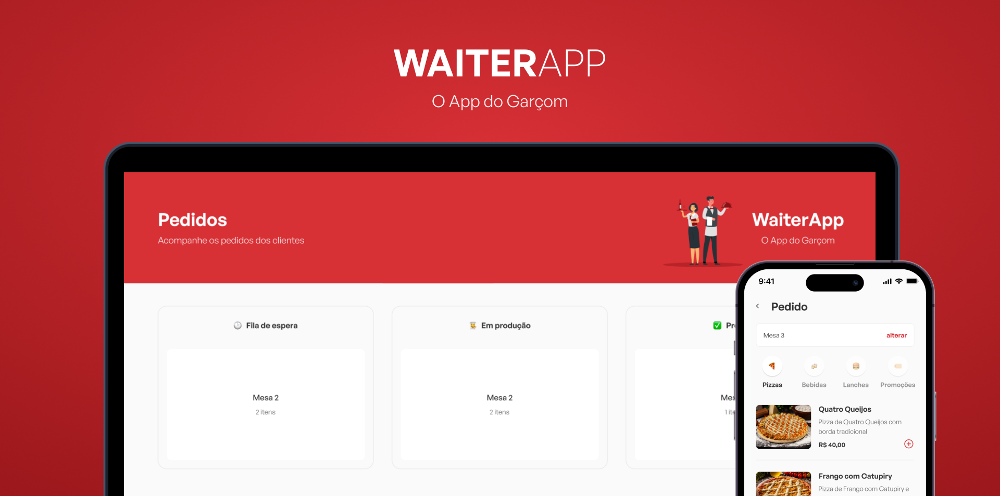

<h1 align="center">WaiterApp</h1>

<p align="center">
WaiterApp é uma aplicação fullstack (frontend, backend e mobile) desenvolvido durante o evento O Poder do Javascript, promovido pelo mestre Mateus Silva. Ela funciona como um cardápio digital em que os clientes podem fazer seus pedidos. Além disso, essa aplicação ainda permite o gerenciamento dos pedidos.
</p>

<p align="center">
  <a href="#-tecnologias">Tecnologias</a>&nbsp;&nbsp;&nbsp;|&nbsp;&nbsp;&nbsp;
  <a href="#-layout">Layout</a>&nbsp;&nbsp;&nbsp;|&nbsp;&nbsp;&nbsp;
  <a href="#memo-licença">Licença</a>
</p>

<p align="center">
  
</p>


<p align="center">
  
</p>

## 🚀 Tecnologias

Esse projeto foi desenvolvido com as seguintes tecnologias:

- ReactJS
- React Native
- TypeScript
- Styled components
- React Toastify
- Socket.io
- Expo
- Express
- MongoDB
- Multer
- Figma

## ⚙️ Instalação

```
# Abra um terminal e copie este repositório com o comando
$ git clone https://github.com/AdrianMouzinho/waiterapp.git

# Acesse a pasta da aplicação
$ cd waiterapp
```

```
# Acesse a pasta do backend
$ cd server

# Instale as dependências
$ npm install

# Renomei o arquivo .env.example para .env e coloque a sua url de conexão do mongodb

# Faça o build
$ npm run build

# Inicie a aplicação
$ npm run start

# Utilize o insomnia ou outro programa para cadastrar as categorias e os produtos, respectivamente

```

```
# Abra outro terminal e acesse a pasta do frontend
$ cd web

# Instale as dependências
$ npm install

# Abra o arquivo api.ts que está em src/utils/api.ts e troque o ip 192.168.48.147 para o ip da sua rede

# Inicie a aplicação
$ npm run dev

```

```
# Abra outro terminal e acesse a pasta do app mobile
$ cd mobile

# Instale as dependências
$ npm install

# Abra o arquivo api.ts que está em src/utils/api.ts e troque o ip 192.168.48.147 para o ip da sua rede

# Inicie a aplicação
$ npm run start

```

## :memo: Licença

Esse projeto está sob a licença MIT.

<p>Feito com 💙 por Adrian Mouzinho</p>
